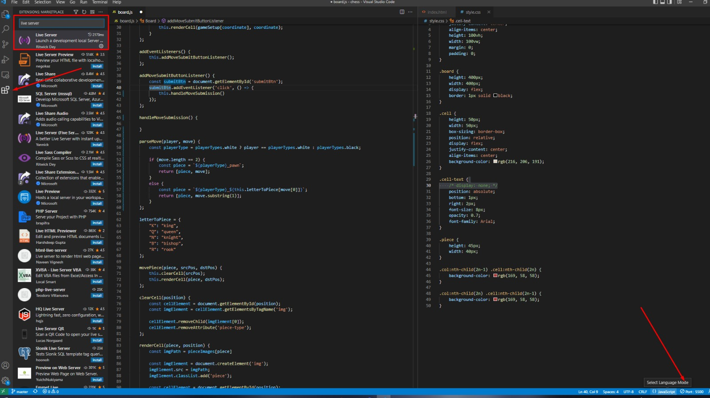

Welcome to my chess app. I've created this just for fun.

I drew heavy influence from tudorfis (see his version [here](https://github.com/tudorfis/chess))

To run this code:

1. Click the extensions tab on the left side of VSCode and download the "Live Server" extension
2. Open the project folder up in VSCode
3. Click the "Go Live" button in the lower right corner